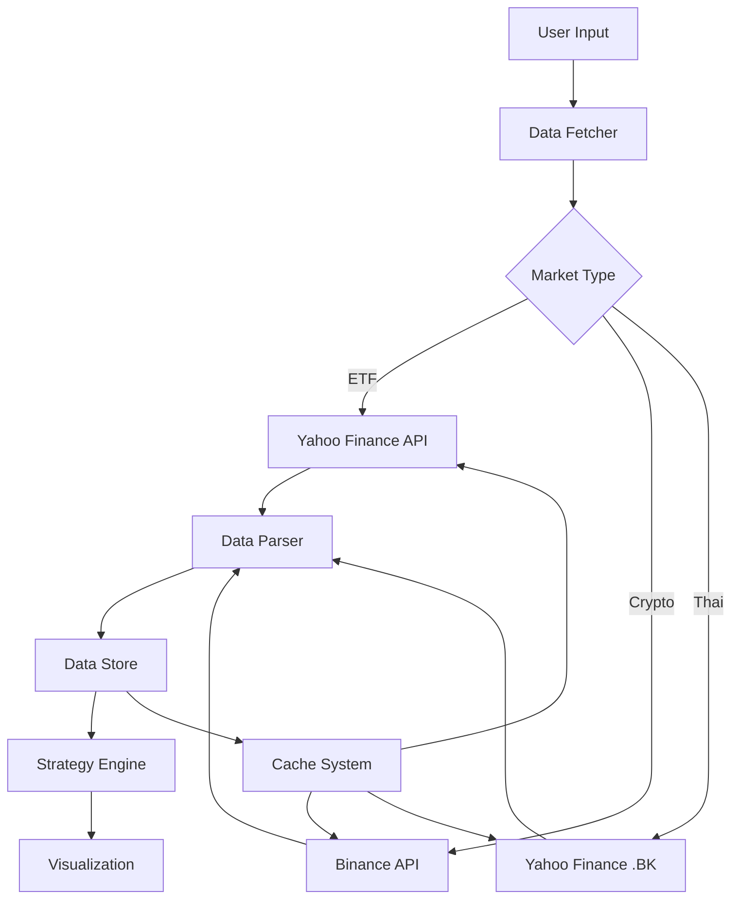
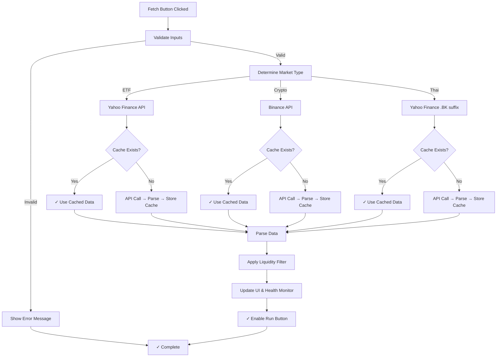
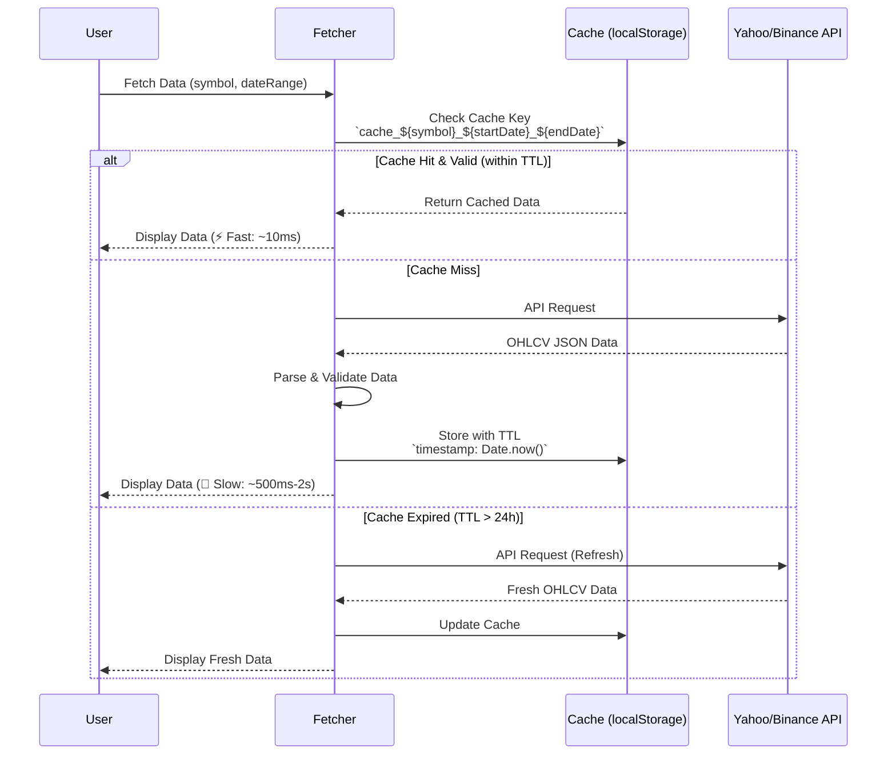
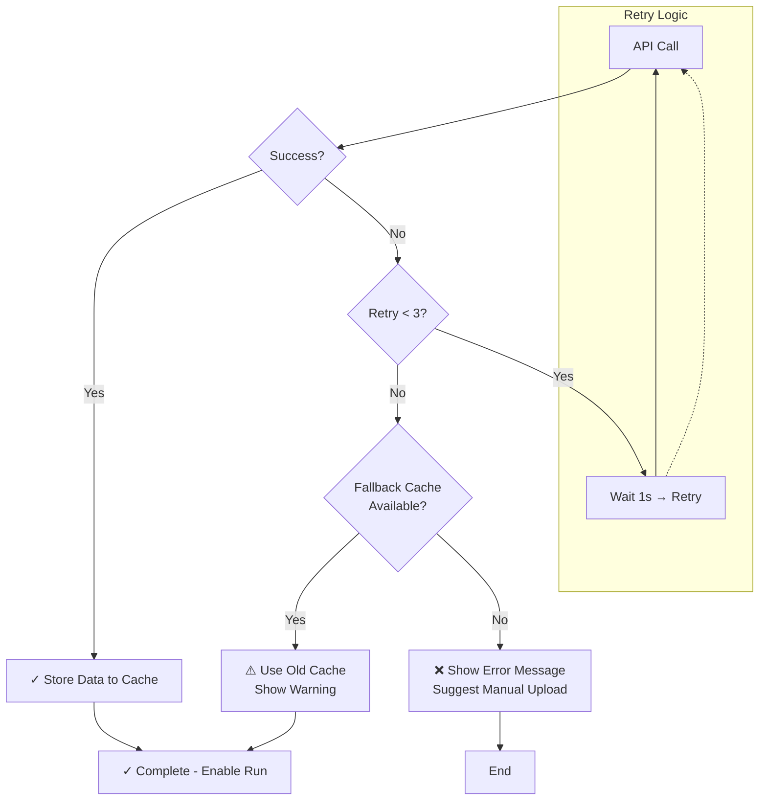
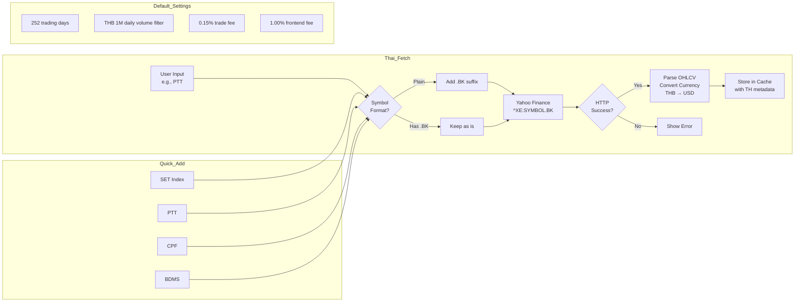
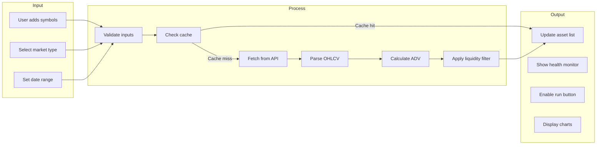

# 📊 System Diagrams - Global Portfolio Engine Data Fetch

**Project:** global-portfolio-engine-etf-crypto  
**Last Updated:** 2026-05-27  
**Version:** v50.0

---

## 1. High-Level Architecture



**Description:**  
ระบบรับ input จาก user (symbols, date range) → ส่งไปยัง Data Fetcher → ตรวจสอบประเภทตลาด → เรียก API ที่เหมาะสม → Parse ข้อมูล → เก็บใน Data Store → ใช้ใน Strategy Engine → แสดงผลบน Visualization

---

## 2. Detailed Fetch Flow



**Flow Details:**

| Step | Description |
|------|-------------|
| Validate | ตรวจสอบ symbols และ date range ว่าถูกต้อง |
| Determine | เช็คว่าเป็น ETF / Crypto / Thai market |
| Fetch | เรียก API ที่เหมาะสม |
| Cache Check | ตรวจสอบว่ามี cache ที่ยังไม่หมดอายุหรือไม่ |
| Parse | แปลงข้อมูล OHLCV ให้อยู่ในรูปแบบที่ต้องการ |
| Liquidity | คำนวณ ADV และกรอง assets ที่มีสภาพคล่องต่ำ |
| Update UI | แสดงข้อมูลใน health monitor |
| Enable Run | เปิดปุ่ม Run ให้ใช้งานได้ |

---

## 3. Cache Strategy



**Cache Configuration:**

```javascript
const CACHE_CONFIG = {
    // TTL (Time To Live) - 24 hours
    TTL: 24 * 60 * 60 * 1000,
    
    // Max cache size (5MB)
    MAX_SIZE: 5 * 1024 * 1024,
    
    // Auto-refresh threshold (1 hour before expiry)
    REFRESH_THRESHOLD: 60 * 60 * 1000,
    
    // Cache key format
    KEY_FORMAT: 'gpe_cache_{symbol}_{startDate}_{endDate}'
};
```

**Cache Key Example:**
```
gpe_cache_SPY_2024-01-01_2024-12-31
gpe_cache_BTCUSDT_2024-01-01_2024-12-31
gpe_cache_SET.BK_2024-01-01_2024-12-31
```

---

## 4. Error Handling & Retry Logic



**Retry Configuration:**

```javascript
const RETRY_CONFIG = {
    MAX_RETRIES: 3,
    RETRY_DELAY: 1000, // 1 second
    BACKOFF_MULTIPLIER: 2, // Exponential backoff
    TIMEOUT: 10000 // 10 seconds per request
};

// Retry schedule: 1s → 2s → 4s
```

**Error Messages:**

| Error | Message |
|-------|---------|
| Network Error | "ไม่สามารถเชื่อมต่ออินเทอร์เน็ต กรุณาตรวจสอบการเชื่อมต่อ" |
| Rate Limit | "เกินขีดจำกัดการเรียก API กรุณารอสักครู่" |
| Symbol Not Found | "ไม่พบข้อมูลสำหรับ {symbol} กรุณาตรวจสอบชื่อ" |
| Invalid Date | "รูปแบบวันที่ไม่ถูกต้อง กรุณาเลือกวันที่ใหม่" |
| Cache Failed | "เกิดข้อผิดพลาดในการบันทึก cache ข้อมูลจะถูกดึงใหม่" |

---

## 5. Thai Market Data Flow



**Thai Market Symbol Mapping:**

| User Input | Full Symbol | Yahoo URL |
|------------|-------------|-----------|
| SET | ^SET.BK | https://finance.yahoo.com/quote/^SET.BK |
| SET50 | ^SET50.BK | https://finance.yahoo.com/quote/^SET50.BK |
| PTT | PTT.BK | https://finance.yahoo.com/quote/PTT.BK |
| CPF | CPF.BK | https://finance.yahoo.com/quote/CPF.BK |
| BDMS | BDMS.BK | https://finance.yahoo.com/quote/BDMS.BK |

---

## 6. Data Flow Summary



---

## 📝 Notes

- **Cache TTL:** 24 ชั่วโมง (สามารถปรับได้ใน Config)
- **Retry:** สูงสุด 3 ครั้ง พร้อม exponential backoff
- **Thai Market:** ใช้ Yahoo Finance กับ .BK suffix
- **Data Format:** OHLCV (Open, High, Low, Close, Volume)

---

**Last Updated:** 2026-05-27  
**Status:** ✅ Complete